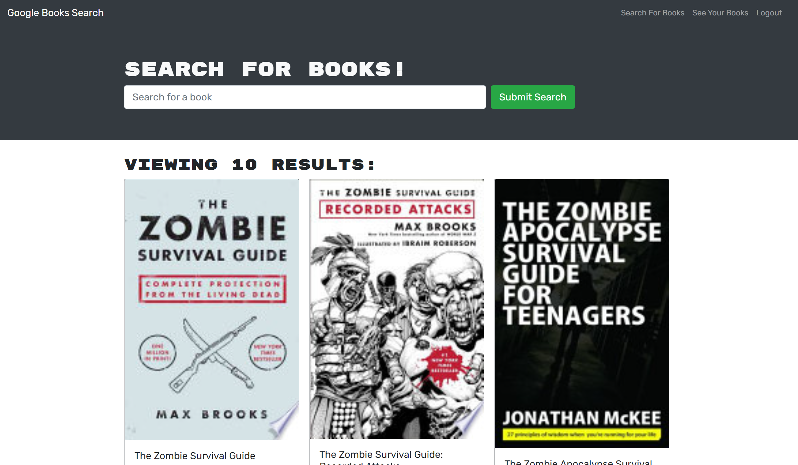
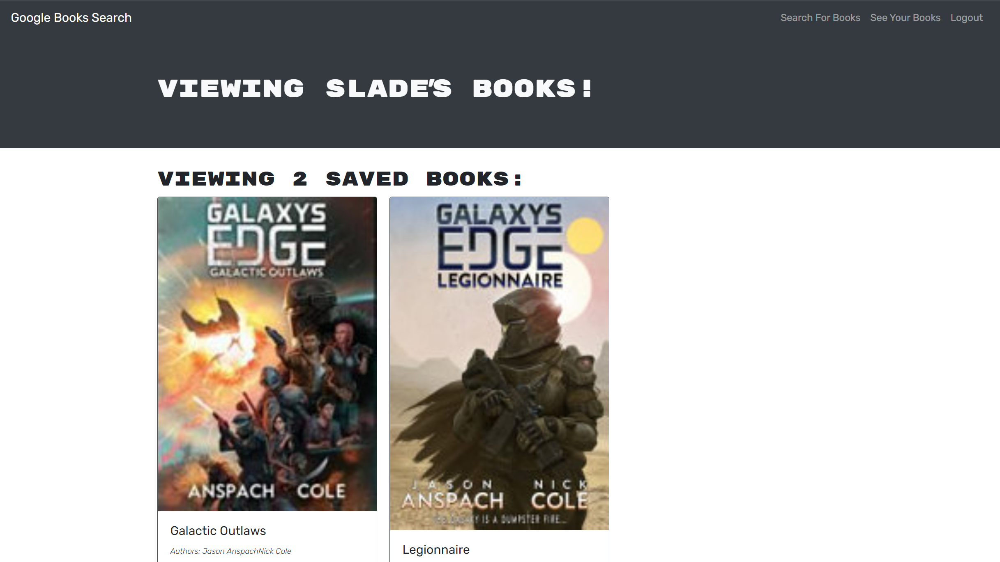

# My Book Shelf
An app for finding books you love and adding them to a virtual shelf.

## Table of Contents

1. [Description](#description)

1. [Technologies and Skills](#technologies)

1. [Screenshot](#screenshot)

1. [Link to Deployed App](#sample)

1. [Installation](#installation)

1. [Use](#usage)

1. [License](#license)

1. [Author](#author)

1. [Contact](#contact)

## Description

* This application allows the user to search for books using amazon's api and save selected books to a list of pending reads.  The user makes login credentials and the books added to their personal reading list are stored to a mongo database.

## Technologies and Skills Demonstrated

* Mongodb
* Express
* React
* Node
* GraphQL
* Apollo server
* HTML & CSS

## Screenshots

## Visit the App deployed on Heroku

* [Link to Deployed Application](https://stark-reaches-88697.herokuapp.com/)

## Installation

* Run the following to install dependancies, the following will be installed, express, mongoose, morgan

> npm install

## Usage

* The repo can be forked and then the required modules installed as per above.  The application is run from the command line by entering "npm run develop"

## License

- MIT

## Author

* Ben Slinde

## Contact me

* If you would like, you can connect with me thru my github profile [Github Profile](https://github.com/stevenslade)
